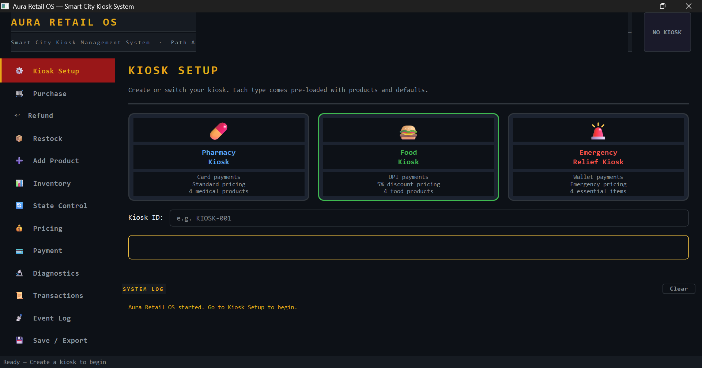

# 🛒 Aura Retail OS — Path A: Adaptive Autonomous System

> Python 3.10+ · Nine GoF Design Patterns · IT620 Project · Smart City Kiosk Platform

---

## Table of Contents

1. [Project Overview](#project-overview)
2. [Design Patterns Implemented](#design-patterns-implemented)
3. [OOP Principles](#oop-principles)
4. [System Constraints Addressed](#system-constraints-addressed)
5. [Folder Structure](#folder-structure)
6. [Prerequisites & Installation](#prerequisites--installation)
7. [Demo Method 1 — Automated Simulation](#demo-method-1--automated-simulation-mainpy)
8. [Demo Method 2 — Interactive CLI](#demo-method-2--interactive-cli-clipy)
9. [Demo Method 3 — Desktop GUI](#demo-method-3--desktop-gui-guipy)
10. [Unit Tests](#unit-tests)
11. [Simulation Scenarios (main.py)](#simulation-scenarios-mainpy)

---

## Project Overview

**Aura Retail OS** is a modular retail kiosk simulation for the smart city of **Zephyrus**.
It implements **Path A — Adaptive Autonomous System**, demonstrating how a kiosk platform
dynamically adapts to emergencies, hardware failures, dynamic pricing, and system-wide
events through nine Gang-of-Four object-oriented design patterns.

The system supports three kiosk variants — **Pharmacy**, **Food**, and **Emergency Relief** —
each assembled by a dedicated Abstract Factory. Every state-changing operation is a Command
object with full audit logging, inventory changes are atomic with Memento-based rollback,
and all subsystem events are broadcast to decoupled Observer subscribers.

Three independent entry points are provided:

| File | Mode | Description |
|------|------|-------------|
| `main.py` | Automated | Runs 5 pre-scripted scenarios end-to-end |
| `cli.py`  | Interactive CLI | Full menu-driven terminal interface |
| `gui.py`  | Desktop GUI | Full PySide6 graphical application |

---

## Design Patterns Implemented

| # | Pattern | File | Role |
|---|---------|------|------|
| 1 | **Singleton** | `core/central_registry.py` | One global registry for config, runtime status, and event log |
| 2 | **Abstract Factory** | `core/kiosk_factory.py` | Creates compatible families of kiosk components (dispenser, payment, inventory) |
| 3 | **State** | `state/kiosk_state.py` | Kiosk operational modes — each state enforces its own purchase rules |
| 4 | **Strategy** | `pricing/strategy.py`, `payment/strategy.py` | Swappable pricing and payment algorithms, hot-swappable at runtime |
| 5 | **Command** | `core/commands.py` | Encapsulates purchase / refund / restock as executable, auditable objects |
| 6 | **Chain of Responsibility** | `failure/handler.py` | Retry → Recalibrate → Alert failure recovery escalation chain |
| 7 | **Memento** | `memento/memento.py` | Snapshots inventory state before each purchase; restores on failure |
| 8 | **Observer** | `events/event_bus.py` | Decoupled event bus; 3 built-in subscribers react to system events |
| 9 | **Facade** | `core/kiosk_interface.py` | Single simplified API hiding all subsystem complexity from callers |

---

## OOP Principles

| Principle | Where demonstrated |
|-----------|-------------------|
| **Encapsulation** | `Inventory._items` is private; all mutations go through controlled methods (`reserve`, `commit_deduction`, `restock`) |
| **Abstraction** | `KioskState`, `PricingStrategy`, `PaymentStrategy`, `FailureHandler` are all abstract base classes |
| **Inheritance** | All concrete states / strategies / handlers / subscribers extend abstract bases |
| **Polymorphism** | `KioskInterface` works with any `PricingStrategy` or `PaymentStrategy` without knowing the concrete type |
| **Low coupling** | `Kiosk` publishes to `EventBus`, never to subscribers directly; `Command` objects take abstract interfaces, not concrete classes |

---

## System Constraints Addressed

| Constraint | Implementation |
|---|---|
| Purchase limit in Emergency mode | `EmergencyState.handle_purchase()` hard-caps at 2 units per transaction |
| Atomic transactions | `PurchaseCommand` releases stock reservation if payment or any later step fails |
| Hardware dependency enforcement | `Inventory.available_stock()` returns 0 when `hw_ok = False`, regardless of total stock |
| Inventory consistency | Stock is committed (`commit_deduction`) only after all steps succeed |
| Thread-safe inventory | `Inventory` uses `threading.Lock` on every mutation method |
| Failure recovery | Three-handler chain (Retry → Recalibrate → Alert) resolves failures without crashing |
| Audit trail | Every command is recorded in `CommandInvoker` history with type, amount, status, and timestamp |

---

## Folder Structure

```
aura_retail_os/
│
├── main.py                      # DEMO 1 — Automated simulation (5 scenarios)
├── cli.py                       # DEMO 2 — Interactive CLI console
├── gui.py                       # DEMO 3 — PySide6 desktop GUI
│
├── core/
│   ├── central_registry.py      # SINGLETON — global config, status, event log
│   ├── kiosk.py                 # Core kiosk orchestrator (uses all patterns)
│   ├── kiosk_interface.py       # FACADE — public API
│   ├── kiosk_factory.py         # ABSTRACT FACTORY — Pharmacy / Food / Emergency
│   └── commands.py              # COMMAND — Purchase, Refund, Restock + Invoker
│
├── state/
│   └── kiosk_state.py           # STATE — Active / PowerSaving / Maintenance / Emergency
│
├── pricing/
│   └── strategy.py              # STRATEGY — Standard / Discount / Emergency pricing
│
├── payment/
│   └── strategy.py              # STRATEGY — UPI / Card / Wallet payment methods
│
├── failure/
│   └── handler.py               # CHAIN OF RESPONSIBILITY — Retry → Recalibrate → Alert
│
├── memento/
│   └── memento.py               # MEMENTO — InventoryMemento + TransactionCaretaker
│
├── events/
│   └── event_bus.py             # OBSERVER — EventBus + 3 built-in subscribers
│
├── inventory/
│   └── inventory.py             # Thread-safe inventory with derived available_stock
│
├── models/
│   └── product.py               # Product data model
│
├── persistence/
│   └── storage.py               # JSON persistence helpers
│
├── data/                        # Auto-created JSON files (inventory, transactions)
│
└── tests/
    └── test_aura_retail_os.py   # 41 unit tests covering all 9 patterns
```

---

## Prerequisites & Installation

### Python version

Python **3.10 or newer** is required.

```bash
python --version    # must show 3.10 or higher
```

### Standard simulation and CLI

`main.py` and `cli.py` use **only the Python standard library** — no packages to install.

### GUI only

The desktop GUI requires **PySide6**:

```bash
pip install PySide6
```

Verify the installation:

```bash
python -c "from PySide6.QtWidgets import QApplication; print('PySide6 OK')"
```

---

## Demo Method 1 — Automated Simulation (`main.py`)

Runs five pre-scripted scenarios sequentially with no user input needed.
Each scenario demonstrates a specific set of design patterns with console output
that labels every step, pattern, and result.

### Run

```bash
cd aura_retail_os
python main.py
```

### What it demonstrates

| Scenario | Patterns exercised | What you see |
|---|---|---|
| 1 — Dynamic Pricing | Strategy, Facade | Standard → Discount → Emergency pricing; payment method swap |
| 2 — State Transitions | State, Observer | Active → PowerSaving → Maintenance → Emergency → Active |
| 3 — Hardware Failure | Chain of Responsibility, Memento | Fault injection, chain resolution, inventory rollback |
| 4 — Event Notifications | Observer, Singleton | LowStock, HardwareFailure, EmergencyActivated sent to subscribers |
| 5 — Full Lifecycle | Command, Persistence | Purchase → Refund → Restock → save to JSON |

### Expected output (excerpt)

```
=================================================================
  SCENARIO 1 — Dynamic Pricing Strategy Change
=================================================================

Step 1: Purchase with Standard pricing
  [Card] Charged ₹50.00 to USER-001
  Result: Success (txn=A1B2C3D4, amount=₹50.00)

Step 2: Switch to Discount pricing (10% off)
  [Card] Charged ₹45.00 to USER-001
  Result: Success (txn=E5F6G7H8, amount=₹45.00)

Step 3: Switch to Emergency pricing
  [Card] Charged ₹40.00 to USER-001   ← essential item discounted 20%
  Result (essential item — discounted): Success (txn=..., amount=₹40.00)
```

---

## Demo Method 2 — Interactive CLI (`cli.py`)

A full-featured terminal console with colour-coded menus. Every system feature
is accessible in any order. The menu stays open until you choose to quit.

### Run

```bash
cd aura_retail_os
python cli.py
```

> **Windows users:** colour output works in Windows Terminal or PowerShell.
> It also works in any standard Linux/macOS terminal.

### Main Menu

When the CLI starts you will see:

```
╔══════════════════════════════════════════════════════════════╗
║           AURA RETAIL OS  ·  SMART CITY KIOSK SYSTEM         ║
║                  Interactive CLI Console                     ║
╚══════════════════════════════════════════════════════════════╝

  Main Menu

  [K]  Select / Create Kiosk
  [P]  Purchase Item
  [R]  Refund Transaction
  [S]  Restock Inventory
  [A]  Add New Product
  [I]  View Inventory
  [T]  Kiosk State
  [C]  Pricing Strategy
  [M]  Payment Method
  [D]  Diagnostics
  [H]  Transaction History
  [E]  System Event Log
  [J]  Save Session to JSON
  [F]  Failure Handler Chain Demo
  [Q]  Quit
```

Type the letter shown in brackets and press **Enter**. A live status bar at the top
of every screen shows the active kiosk ID, state, pricing, and payment method.

### Step-by-step walkthrough

#### Step 1 — Create a kiosk  `[K]`

Press `K`, select a kiosk type:

```
  1. Pharmacy Kiosk          (Card payments, Standard pricing)
  2. Food Kiosk               (UPI payments, 5% discount)
  3. Emergency Relief Kiosk   (Wallet payments, Emergency pricing)
```

Enter a Kiosk ID (or press Enter to accept the default). The kiosk is created
with its default inventory and all Observer subscribers connected.

#### Step 2 — View inventory  `[I]`

Press `I` to see the inventory table:

```
  ID            Name                      Price   Total   Avail   HW    Essential
  ──────────────────────────────────────────────────────────────────────────────
  MED-001       Paracetamol 500mg         25.00     100     100   OK       ✓
  MED-002       Bandage                   15.00      60      60   OK       ✓
  MED-003       Antiseptic                30.00      40      40   OK       ✓
  MED-004       Vitamin C Tablets         20.00      80      80   OK
```

You can also set or restore hardware faults from this screen.

#### Step 3 — Purchase an item  `[P]`

Press `P`. You will be prompted for:

```
  Product ID  [type or refer to inventory table above]
  Quantity    [default: 1]
  User ID     [default: USER-001]

  Payment method:
  1. UPI    2. Card    3. Wallet

  Pricing strategy:
  1. Standard    2. Discount 10%    3. Emergency
```

The system enforces all constraints (state limits, stock availability, hardware status)
and prints the result with the transaction ID and amount charged.

#### Step 4 — Change kiosk state  `[T]`

Press `T` to switch operational modes:

```
  1. ACTIVE        — full operation
  2. POWER_SAVING  — quantity capped at 5 per transaction
  3. MAINTENANCE   — all purchases blocked
  4. EMERGENCY     — quantity capped at 2; Observer notifies CityMonitor
```

#### Step 5 — Simulate hardware failure  `[I]`

Press `I`, then choose **Set Hardware FAULT** and enter a Product ID.
That product's `available_stock` immediately becomes 0. Purchase attempts
are blocked. Press **Restore Hardware OK** to recover.

#### Step 6 — Test the failure chain  `[F]`

Press `F` — **Failure Handler Chain Demo**. Type any failure description:

```
  Describe the failure [timeout occurred]:
```

- `timeout occurred`       → **RetryHandler** resolves it
- `motor jam detected`     → **RecalibrateHandler** resolves it
- `completely unknown xyz` → escalates to **AlertHandler**

#### Step 7 — Review history and logs

- `[H]` — full transaction history (type, product, qty, amount, pricing, payment, status)
- `[E]` — complete `CentralRegistry` event log with timestamps

#### Step 8 — Add a custom product  `[A]`

Press `A` to register a new product at runtime:

```
  Product ID:      CUSTOM-001
  Product name:    Hand Sanitizer
  Base price:      35.00
  Category:        hygiene
  Initial stock:   50
  Essential:       y
```

#### Step 9 — Save and quit  `[J]` / `[Q]`

Press `J` to export inventory and transaction history to JSON files.
Press `Q` to exit cleanly.

---

## Demo Method 3 — Desktop GUI (`gui.py`)

A full PySide6 desktop application with an industrial-dark amber theme.
Every feature available in the CLI is available here, presented through
a sidebar-navigated multi-panel interface with live updates.

### Run

```bash
cd aura_retail_os
python gui.py
```

> Requires PySide6. Install with `pip install PySide6`.

### Interface layout

```
┌─────────────────────────────────────────────────────────────┐
│  AURA RETAIL OS                  ● ACTIVE   🖥 KIOSK-PH     │  ← Header with live badge
├──────────┬──────────────────────────────────────────────────┤
│          │                                                  │
│ ⚙ Setup  │                                                  │
│ 🛒 Buy   │              Main content panel                  │
│ ↩ Refund │         (changes with sidebar selection)         │
│ 📦 Stock │                                                  │
│ ➕ Add   │                                                  │
│ 📊 Inv.  │                                                  │
│ 🔄 State │                                                  │
│ 💰 Price │                                                  │
│ 💳 Pay   │                                                  │
│ 🔬 Diag. │                                                  │
│ 📜 Txns  │                                                  │
│ 📡 Log   │                                                  │
│ 💾 Save  │                                                  │
├──────────┴──────────────────────────────────────────────────┤
│  SYSTEM LOG  (live event stream — always visible)           │  ← Bottom log strip
└─────────────────────────────────────────────────────────────┘
```

### GUI Screenshot
```



```
### Step-by-step walkthrough

#### Step 1 — Kiosk Setup  `⚙`

Three kiosk-type cards are shown side by side. Click one to select it:

- **Pharmacy Kiosk** — Card payments, Standard pricing, 4 medical products
- **Food Kiosk** — UPI payments, 5% discount, 4 food products
- **Emergency Relief Kiosk** — Wallet payments, Emergency pricing, 4 essential items

Optionally edit the Kiosk ID field, then click **▶ Launch Kiosk**.
The header bar immediately shows the kiosk ID and a colour-coded state badge.

#### Step 2 — Purchase  `🛒`

The inventory table at the top is clickable — click any row to auto-fill the Product ID.
Fill in quantity, user ID, payment method, and pricing strategy. A **live price preview**
updates as you change quantity or pricing. Click **PURCHASE** — a popup confirms the
transaction ID and amount, or explains exactly why it was blocked.

#### Step 3 — Inventory  `📊`

Full inventory grid showing: ID, name, category, price, total stock, reserved stock,
derived available stock, hardware status, and essential flag.
Select a row and click **Set HW Fault** to simulate a hardware failure, or
**Restore HW** to recover it.

#### Step 4 — State Control  `🔄`

Four large state cards with colour coding:

- 🟢 **ACTIVE** — green — full operation
- 🟡 **POWER SAVING** — amber — quantity capped at 5
- 🔴 **MAINTENANCE** — red — all purchases blocked
- 🔴 **EMERGENCY** — bright red — quantity capped at 2, city notified

Click any card to instantly switch. The header badge colour updates to reflect the new state.

#### Step 5 — Pricing  `💰`

Five options displayed as accent-bordered buttons:

```
Standard       — Full price. No adjustments.
Discount 5%    — 5% off all products.
Discount 10%   — 10% off all products.
Discount 20%   — 20% off. Heavy discount season.
Emergency      — Essential: −20%.  Non-essential: +15%.
```

The current strategy is shown at the top of the panel and updates immediately.

#### Step 6 — Payment Method  `💳`

Three large buttons — **📱 UPI**, **💳 Card**, **👛 Wallet**. Click one to hot-swap
the default payment method. Future purchases use the new method unless overridden
per transaction in the Purchase panel.

#### Step 7 — Refund  `↩`

The top table shows recent successful purchases. Click a row to auto-fill the
product ID, quantity, amount, and reference fields. Adjust as needed, then click
**PROCESS REFUND**. The payment is reversed and stock returned.

#### Step 8 — Diagnostics  `🔬`

Click **Run Diagnostics** for a live snapshot: kiosk ID, current state, pricing,
payment method, number of inventory items, and a full inventory summary table
with hardware status per product.

#### Step 9 — Transactions & Event Log

- **📜 Transactions** — every command recorded: type, product, qty, amount, pricing,
  payment, status (green = SUCCESS, red = FAILED).
- **📡 Event Log** — the full `CentralRegistry` log, colour-coded by severity.

#### Step 10 — Save / Export  `💾`

Set output file paths and click **Save to JSON** to export inventory and
transaction history. Files are created in the `data/` directory by default.

#### Live System Log strip

The bottom strip updates in real time as events fire — purchases, state changes,
low stock alerts, hardware events, Observer notifications — all visible without
leaving the current panel.

---

## Unit Tests

41 unit tests covering all nine design patterns and core business logic.

### Run all tests

```bash
cd aura_retail_os
python -m unittest tests.test_aura_retail_os -v
```

### Run a specific test class

```bash
# Singleton
python -m unittest tests.test_aura_retail_os.TestSingleton -v

# State pattern
python -m unittest tests.test_aura_retail_os.TestKioskState -v

# Strategy — Pricing
python -m unittest tests.test_aura_retail_os.TestPricingStrategy -v

# Command pattern
python -m unittest tests.test_aura_retail_os.TestCommands -v

# Chain of Responsibility
python -m unittest tests.test_aura_retail_os.TestFailureHandlers -v

# Memento
python -m unittest tests.test_aura_retail_os.TestMemento -v

# Observer
python -m unittest tests.test_aura_retail_os.TestEventBus -v

# Inventory (derived attributes)
python -m unittest tests.test_aura_retail_os.TestInventory -v

# Abstract Factory
python -m unittest tests.test_aura_retail_os.TestAbstractFactory -v

# Facade
python -m unittest tests.test_aura_retail_os.TestFacade -v
```

### Test coverage summary

| Test Class | Tests | Patterns verified |
|---|---|---|
| `TestSingleton` | 3 | Singleton |
| `TestKioskState` | 5 | State |
| `TestPricingStrategy` | 4 | Strategy |
| `TestCommands` | 5 | Command |
| `TestFailureHandlers` | 4 | Chain of Responsibility |
| `TestMemento` | 2 | Memento |
| `TestEventBus` | 4 | Observer |
| `TestInventory` | 5 | Inventory / derived attributes |
| `TestAbstractFactory` | 3 | Abstract Factory |
| `TestFacade` | 6 | Facade |
| **Total** | **41** | **All 9 patterns** |

---

## Simulation Scenarios (`main.py`)

### Scenario 1 — Dynamic Pricing Change
**Patterns:** Strategy, Facade, Singleton

Purchases the same product three times using three different pricing strategies
(Standard → Discount 10% → Emergency), then swaps the payment method from Card
to UPI and purchases again. Shows that both pricing and payment are fully
hot-swappable at runtime without any restart.

### Scenario 2 — Kiosk State Transitions
**Patterns:** State, Observer, Facade

Walks the kiosk through every operational state. In `POWER_SAVING`, a purchase
of 10 units is blocked (cap is 5) but 3 succeeds. In `MAINTENANCE`, all purchases
are blocked. In `EMERGENCY`, a purchase of 3 is blocked (cap is 2) but 2 succeeds.
The Observer fires `EmergencyModeActivated` to `CityMonitoringSubscriber`.

### Scenario 3 — Hardware Failure Recovery
**Patterns:** Chain of Responsibility, Memento, Observer, Facade

A product's hardware is faulted, a purchase attempt is blocked, and the Observer
fires `HardwareFailureEvent`. The Chain of Responsibility handles `"motor jam"`
and `RecalibrateHandler` resolves it. Hardware is restored and a subsequent
purchase succeeds. Inventory stock is verified to be consistent throughout
(Memento rollback confirmed no phantom deductions occurred).

### Scenario 4 — Event-Driven Notifications
**Patterns:** Observer, Singleton, State

Nearly all stock of a product is purchased, triggering `LowStockEvent` to
`SupplyChainSubscriber`. Emergency mode is then activated, firing
`EmergencyModeActivated` to `CityMonitoringSubscriber`. The full
`CentralRegistry` event log is printed at the end.

### Scenario 5 — Full Transaction Lifecycle with Persistence
**Patterns:** Command, Facade, Persistence

A complete purchase → refund → restock cycle is executed. All inventory and
transaction data are exported to JSON files. The `CommandInvoker` transaction
history is printed showing every command with type, amount, and status.

---

## Quick Reference

| Goal | Command |
|------|---------|
| Automated scenarios | `python main.py` |
| Interactive CLI | `python cli.py` |
| Desktop GUI | `python gui.py` |
| All unit tests | `python -m unittest tests.test_aura_retail_os -v` |
| Single test class | `python -m unittest tests.test_aura_retail_os.TestFacade -v` |
| Install GUI dependency | `pip install PySide6` |
